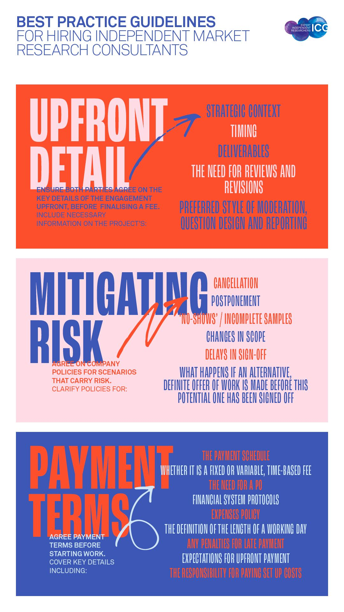

Independent market researchers help the industry function better, by allowing companies to take on more projects without the risk of hiring full-time employees. However, sometimes the relationship does not run smoothly – especially when one party has different expectations from the other.

 

That’s why I spearheaded this initiative with the ICG (Independent Consultants Group) to define best practice in context of hiring independent research consultants. To read more about it check out [this ](https://theicg.co.uk/best-practice/)article.

 

In the past, I have been both an independent research consultant myself and more recently someone that hires them, so this is topic close to my heart (and business). Feeling Mutual is built on a network of senior, independent researchers around the world and so ensuring working relationships are productive and happy is crucial.

 

As a member of the ICG I noticed some emails from members in the help forum, about engagements that had turned sour. For example, some clients had been slow to pay, expected the fee to stay the same (despite increasing the scope) or they had not agreed to pay cancellation fees.  So along with the ICG and the wider market research industry, I set out to develop these guidelines. If they are followed, I believe the working relationship will be more productive and happier.

 

The guidelines were developed across three phases. First, we ran an online qualitative research discussion with both hirers and independent research consultants. (A big thank you goes to Further, who kindly provided their research platform Together™ for free, shared their ideas and also sponsored the initiative).  In this, we explored what can go wrong (and right) and what makes (or breaks) relationships. This was followed by a real-time brainstorm with 23 ICG members to develop a draft set of guidelines, and finally a survey with 233 independent research consultant and hirers to measure current practices and validate the guidelines (a big thank you goes to Nik Haarta of Yolo Comms who helped with the quantitative consultancy side of this).

 

It became apparent that most of the issues that arise are because insufficient detail was agreed upfront – both parties were making too many assumptions about the other’s policy.  If both independent researchers and the companies that hire them, ensure the following details are covered when a project with a new client is initiated, then the risk of things going wrong will be rapidly reduced.

 

Here are the guidelines. 

 

 

